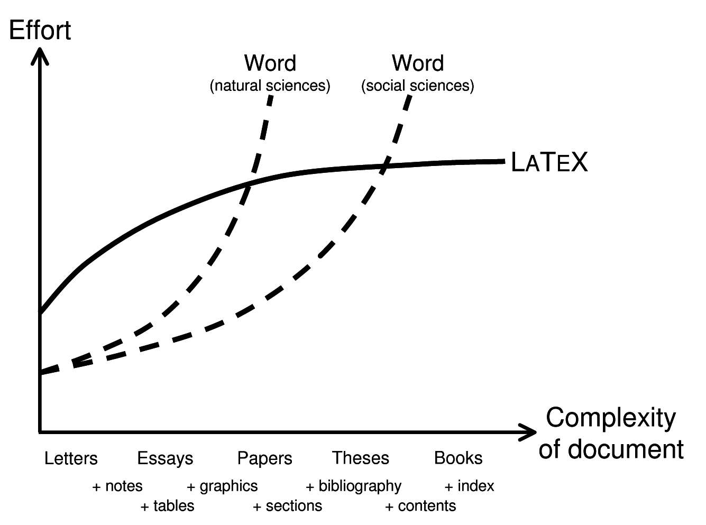

### Latex Workshop
##### Lecture \# 1 : Basics of Latex
Dr. Suresh Kumarasamy  
DS Kothari Postdoc Fellow  
University of Delhi  

### Directory Summary

This README briefly discusses the history and importance of LaTeX.

To Download example files please check [here](https://github.com/prvn-pa/la-tut/releases)

##### History behind <b>LaTeX</b>

<small>
- <b>LaTeX</b> project was started in 1978 by Donald E. Knuth (University of Stanford)  
 </small>

<small>
- Second volume of his Art of Computer Programming. </small>  
<a href="https://github.com/djtrack16/thyme/blob/master/computer%20science/Donald.E.Knuth.The.Art.of.Computer.Programming.Volume.2.pdf">github link</a>

<a href="https://en.wikipedia.org/wiki/TeX">Tex</a>

#### A powerful Typesetting system

- Input for **LaTeX** is composed in plain ASCII using a text editor

-  Eventhough Word is useful for writing very short and simple documents, it becomes complex or even unusable for more complicated tasks

-  Commonly needed features, like user-customized automated numbering or various automated indexes, cannot be created easily in Word 

- *LaTeX* requires more effort and time to learn for simpler tasks, but once learned, difficult tasks can be accomplished rather easily and straightforwardly

##### Comparison 
- *LaTeX* has a greater learning curve 
- Many tasks are very tedious and difficult in MS Word or Libre Office

#### The reasons to use LaTex

- We can do typesetting of mathematical formulae in a convenient way
- Users only need to learn a few easy-to-understand commands that specify the logical structure of a document 
- Never need to tinker with the actual layout of the document 
- Complex structures such as footnotes, references, table of contents, and bibliographies can be generated easily
-  **LaTeX** encourages authors to write well-structured texts, because this is how **LaTeX** works: by specifying structure

#### How LaTex Works 

- First step is that *LaTeX* reads, usually called the **tex** file or the input file, using a simple text editor and saved in ASCII mode.

- The TEX program then reads your input file and produces a **DVI file** (Device Independent). The DVI file is then read by another program (called a device driver) which produces the output that is readable by humans. Why the extra file? 

- Because this DVI file can be read by different device drivers to produce output on a *dot matrix printer, a laser printer, a screen viewer, or a phototypesetter*.

- Once you have produced a DVI file that gives the right output on, say, a screen viewer, you can be assured that you will get exactly the same output on a laser printer without running the TEX program again.

### Input file structure

*LaTeX* processes an input file, it expects it to follow a certain structure.
- Every input file should start with the command  
-  **\documentclass{...}**  
- This specifies what sort of document you intend to write. 
- After that, add commands to influence the style of the whole document, or load packages that add new features to the *LaTeX* system. To load such a package you use the command  
-  **\usepackage{...}** 
- If the *documentclass* and *usepackage* are set then the work is done. Now you can start the body of the text with the command  
-  **\begin {document}**   
     Now you enter the text mixed with some useful *LaTeX* commands. At the end of the document you add the
-  **\end{document}**  command, which tells *LaTeX* to end the document. Anything that follows this command will be ignored by *LaTeX*

### Document Classes

- The first thing that *LaTeX* needs to know is the type of document the author wants to create. 
- This is specified with the  **\documentclass[options]{class}**  command
- Here class specifies the type of document to be created. 
- The options parameter customizes the behaviour of the document class. The options have to be separated by commas.  
Example:  **\documentclass[11pt,twoside,a4paper]{article}** 
- The above commend instructs *LaTeX* to typeset the document as an article with a base font size of eleven points, and to produce a layout suitable for double sided printing on A4 paper. 

### Document Classes

| class 	| description 	|
|-	|:-:	|
| article 	| for articles in scientific journals, presentations, short reports, program documentation, invitations 	|
| proc minimal 	| a class for proceedings based on the article class is as small as it can get. It only sets a page size and a base font. It is mainly used for debugging purposes 	|
| report 	| for longer reports containing several chapters, small books, Master’s and PhD theses 	|
| book 	| for real books 	|
| beamer 	| the *LaTeX* version of Powerpoint 	|

#### Document Class Options

| options 	| description 	|
|:-:	|:-:	|
| 10pt, 11pt, 12pt 	| Sets the size of the main font in the document. Default is 10pt 	|
| a4paper, letterpaper 	| Defines the paper size. Default is letterpaper.others include a5paper, b5paper, executivepaper, legalpaper 	|
| titlepage 	| Specifies whether a new page should be started after the document title or not 	|
| notitlepage 	| article class does not start a new page by default, while report and book do 	|
| onecolumn, twocolumn 	| Instructs *LaTeX* to typeset the document in one or two columns 	|
| landscape 	| Changes the layout of the document to print in landscape mode 	|

### Add on features

- There are some functionalities that you wont be able to do with basic L A TEX 
- Including graphics, color, ect. requires enhancing capabilities by including packages using the   **\usepackage[options]{package}**  command in the preamble of your document 
- Comprehensive TEX Archive Network (CTAN) is the central source for all packages  
www.ctan.org 
   
