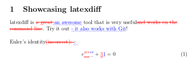
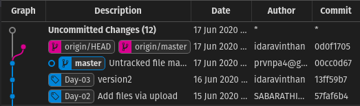
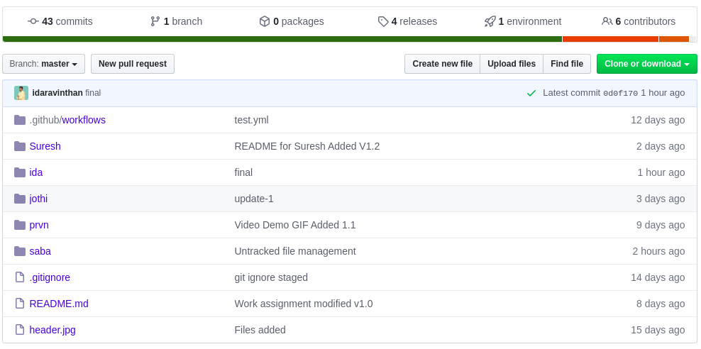

Version Control and Cloud Solutions
===


#### Never Loose a Thing! Versioning and Collaborating: Git, Overleaf & More... ####

##### by Praveen ####

[Email: contact@prvn.info](contact@prvn.info)

---

## What are we going to discuss? ##

1. Summary of the last four days
2. Why versioning is important?
3. Git and Git Hub
4. Cloud Solutions: Overleaf
5. Working in Cloud

---

## Need Assistance? ##


---

## What you have learned so far? ##

* Installation
* Basic LaTeX document
* Tables, figures and math
* Article, thesis and books
* Slide decks and posters

---

## Versions

* `latexdiff`

### Comment summary
```
$ latexdiff --version
$ latexdiff version-01.tex version-02.tex > diff.tex
$ pdflatex diff.tex
```



---

## What is version control? ##


Photo credit: http://smutch.github.io/VersionControlTutorial/

---

## Git ##

* Git is a version control system (VCS) 
* It helps you keep a record of changes you make to files in your project. 
* It keeps track of the changes and enables you to create checkpoints for each change. 
* These checkpoints can also be seen as versions of your project. 
* For example, you create a web form and add a commit, and you decide to edit that form tomorrow, the new change can be considered a new version of your original work.

---

## Here's an example! ##



---

## Diff with Git ##

Install `git-latexdiff` from [here](https://gitlab.com/git-latexdiff/git-latexdiff)

```
$ nano git-test.tex #Include text
$ git init
$ git add git-test.tex
$ git commit -m 'version 1'
$ nano git-test.tex #Modify text and commit again
$ git latexdiff HEAD~1 --main git-test.tex
```

---

## Github ##

* Github is a website for hosting your repositories. 
* A repository is simply a place where you can store your project files and folders. 
* A new repository is created for each project on Git. On your computer, a repository is represented by a folder. 
* After working on your project or a part of it on Git (offline), you can push it to your repository on Github.

---

## Here's an another example! ##



---

# So how to start with `git`? ##

## Step: 01
* Install `git` in your local machine
* Configure it

## Step: 02
* Create a github account
* Create a github repository
* Push your local changes to server

---

## Git Installation ##

In Ubuntu, install git by the command `sudo apt install git`

In windows, download the installer from [here](https://gitforwindows.org/). Run it with administrator privileges. Accept the default values and choose Windows Command Prompt for accessing git.

Verify the installation by `git --version`

Once you installed `git` define global username and mail ID from terminal or command prompt.
```
$ git config --global user.name "Your Name"   
$ git config --global user.email "your@mail.id"
```

---

# Demo: Working with files #

---

# Overleaf: Cloud Solution #

---

