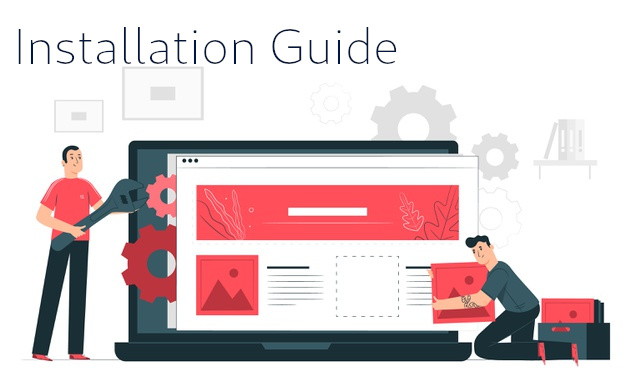
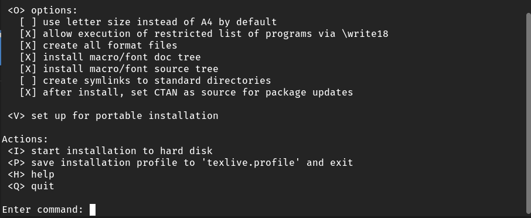
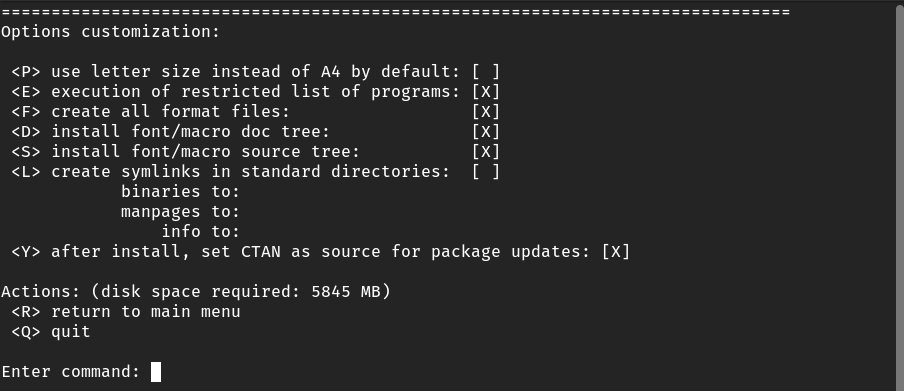

LaTeX
===

#### An Installation guide to LaTeX Environment

##### by Praveen 

[Email: contact@prvn.info](contact@prvn.info)

---

## Installation candidates ##

Two types of files are available.

1. Latex base files
2. Complete ISO file

Base files contains only essential packages to compile a document.

---

### Command line options ###

The following packages can be downloaded via CLI in most of the Linux machines.

* texlive-base - 160 MB
* texlive-latex-recommended - 203 MB
* texlive - 269 MB
* texlive-latex-extra - 464 MB
* texlive-full - 5903 MB

---

In the above, for common users `texlive-base` with either `texlive` or `texlive-latex-extra` is enough.

If you are using Ubuntu profession targeted packages are also available.

* texlive-publishers
* texlive-science
* texlive-pstricks
* texlive-pictures
* texlive-metapost
* texlive-music
* texlive-xetex
* texlive-luatex
* texlive-games
* texlive-humanities

---

### CLI installaion ###

**For Ubuntu:**

> sudo apt install texlive-base

**For Fedora:**

> sudo dnf install texlive-base

**For Arch:**

> sudo pacman -Syu texlive-base

---

## ISO file installation ##

For modern documents it is recommended to use .iso file

The ISO file can be downloaded from here: [TexLive 2020](https://mirror.unpad.ac.id/ctan/systems/texlive/Images/texlive2020.iso)

In linux machine, right click the iso and open it with image mounter.

Now, you should see the image mounted and files should also be accessible.

---

In the case of macOS, go to *Disk utility* and choose *Open Image File*. You should be see the image file mounted on the Desktop.

Here after the installation is pretty striaght forward.

1. Open or navigate the terminal to Texlive directory
2. Run `sudo ./install-tl`
3. It will prompt to an window like this:

---

4. Enter `O` as the command

---

---

5. Now choose L in the command and accept the default values
6. Then enter R to return menu and and type I to begin the installation
7. It would tale 10 - 15 mins depending on machine configuration.
8. Once the installation finished type `latex --version` to verify the installation

---

#### Video Demo

---

## Thank You

  Comment the link for queries

  Or mail to `contact@prvn.ino`